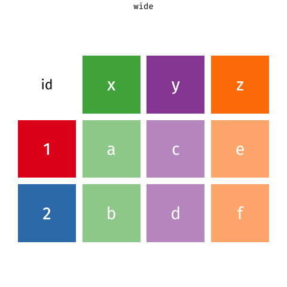

```{r setup, include=FALSE}
knitr::opts_chunk$set(eval = TRUE)
```

Given below are two data visualizations that violate many data visualization best practices.
Improve these visualizations using R and the tips for effective visualizations that we introduced in class.
You should produce one visualization per dataset.
Your visualization should be accompanied by a brief paragraph describing the choices you made in your improvement, specifically discussing what you didn't like in the original plots and why, and how you addressed them in the visualization you created.

On the due date you will give a brief presentation describing one of your improved visualizations and the reasoning for the choices you made.

# Learning goals

-   Telling a story with data
-   Data visualization best practices
-   Reshaping data

# Getting started

Go to the course GitHub organization and locate your homework repo, clone it in RStudio and open the R Markdown document.
Knit the document to make sure it compiles without errors.

## Warm up

Before we introduce the data, let's warm up with some simple exercises.
Update the YAML of your R Markdown file with your information, knit, commit, and push your changes.
Make sure to commit with a meaningful commit message.
Then, go to your repo on GitHub and confirm that your changes are visible in your Rmd **and** md files.
If anything is missing, commit and push again.

## Packages

We'll use the **tidyverse** package for much of the data wrangling and visualisation and the data lives in the **dsbox** package.
These packages are already installed for you.
You can load them by running the following in your Console:

When you do this lab to install `dsbox` you can copy the code below into the console:

```
install.packages("devtools")
devtools::install_github("tidyverse/dsbox")
```

```{r load_library_block, eval = TRUE, message = FALSE}
library(tidyverse) 
library(dsbox) 
```

## Data

The datasets we'll use are called `instructors` and `fisheries` from the **dsbox** package.
Since the datasets are distributed with the package, we don't need to load them separately; they become available to us when we load the package.
You can find out more about the datasets by inspecting their documentation, which you can access by running `?instructors` and `?fisheries` in the Console or using the Help menu in RStudio to search for `instructors` or `fisheries`.
You can also find this information [here](https://rstudio-education.github.io/dsbox/reference/instructors.html) and [here](https://rstudio-education.github.io/dsbox/reference/fisheries.html).

# Exercises

## Instructional staff employment trends

The American Association of University Professors (AAUP) is a nonprofit membership association of faculty and other academic professionals.
[This report](https://www.aaup.org/sites/default/files/files/AAUP_Report_InstrStaff-75-11_apr2013.pdf) compiled by the AAUP shows trends in instructional staff employees between 1975 and 2011, and contains an image very similar to the one given below.

```{r sad_plot_one, echo=FALSE, fig.fullwidth = TRUE}
knitr::include_graphics("img/staff-employment.png")
```

Let's start by loading the data used to create this plot.

```{r load-data-staff, message = FALSE}
staff <- read_csv("data/instructional-staff.csv")
```

Each row in this dataset represents a faculty type, and the columns are the years for which we have data.
The values are percentage of hires of that type of faculty for each year.

```{r display_staff_data, echo = FALSE}
staff
```

In order to recreate this visualization we need to first reshape the data to have one variable for faculty type and one variable for year.
In other words, we will convert the data from wide format to long format.

But before we do so, a thought exercise: *How many rows will the long-format data have?* It will have a row for each combination of year and faculty type.
If there are 5 faculty types and 11 years of data, how many rows will we have?

We do the wide to long conversion using a new function: `pivot_longer()`.
The animation below show how this function works, as well as its counterpart `pivot_wider()`.

```{r pivot_gif, echo = FALSE}

```

The function has the following arguments:

```{r code_picot_longer_example, eval = FALSE}
pivot_longer(data, cols, names_to = "name")
```

-   The first argument is `data` as usual.
-   The second argument, `cols`, is where you specify which columns to pivot into longer format -- in this case all columns except for the `faculty_type`
-   The third argument, `names_to`, is a string specifying the name of the column to create from the data stored in the column names of data -- in this case `year`

```{r staff_longer_dataset}
staff_long <- staff %>%
  pivot_longer(cols = -faculty_type, names_to = "year") %>%
  mutate(year = as.numeric(year))
```

Let's take a look at what the new longer data frame looks like.

```{r displaying_staff_long}
staff_long
```

And now let's plot is as a line plot.
A possible approach for creating a line plot where we color the lines by faculty type is the following:

```{r faculty_type_color_graph, fig.width = 10, fig.fullwidth = TRUE, eval = FALSE}
staff_long %>%
  ggplot(aes(x = year, y = value, color = faculty_type)) +
  geom_line()
```

But note that this results in a message as well as an unexpected plot.
The message is saying that there is only one observation for each faculty type year combination.
We can fix this using the `group` aesthetic following.

```{r faculty_type_color_graph_labeled, fig.width = 10, fig.fullwidth = TRUE}
staff_long %>%
  ggplot(aes(x = year, y = value, group = faculty_type, color = faculty_type)) +
  geom_line() + 
  labs(
    title = "Faculty Trend over time (1975-2011)",
    xlab = "",
    ylab = ""
  ) +
  theme(legend.title = element_blank())
```

1.  Include the line plot you made above in your report and make sure the figure width is large enough to make it legible.
    Also fix the title, axis labels, and legend label.

2.  Suppose the objective of this plot was to show that the proportion of part-time faculty have gone up over time compared to other instructional staff types.
    What changes would you propose making to this plot to tell this story and why.
    
***Either make the proportion of part time faculty a more noticable color and make the others more background colors, or make the other lines dimmer (like the alpha level in scatter plots)***

3.  Implement the changes you proposed in the previous exercise.

```{r faculty_type_graph, fig.width = 10, fig.fullwidth = TRUE}
staff_long %>%
  ggplot(aes(x = year, y = value, group = faculty_type, color = faculty_type)) +
  geom_line() + 
  labs(
    title = "Faculty Trend over time (1975-2011)",
    xlab = "",
    ylab = ""
  ) +
  scale_color_manual(values = c(rep("grey", 4), "red")) +
  theme(legend.title = element_blank())
```

🧶 ✅ ⬆️ Knit, *commit, and push your changes to GitHub with an appropriate commit message. Make sure to commit and push all changed files so that your Git pane is cleared up afterwards.*

## Fisheries

Fisheries and Aquaculture Department of the Food and Agriculture Organization of the United Nations collects data on fisheries production of countries.
[This Wikipedia page](https://en.wikipedia.org/wiki/Fishing_industry_by_country) lists fishery production of countries for 2016.
For each country tonnage from capture and aquaculture are listed.
Note that countries whose total harvest was less than 100,000 tons are not included in the visualization.

A researcher shared with you the following visualization they created based on these data.
😳

```{r sad_plot_two, echo=FALSE, fig.fullwidth = TRUE}
knitr::include_graphics("img/fisheries.png")
```

4.  Can you help them make improve it? First, brainstorm how you would improve it. Then create the improved visualization and write up the changes/decisions you made as bullet points. It's ok if some of your improvements are aspirational, i.e. you don't know how to implement it, but you think it's a good idea.

***Swap x and y on the plot so the labels are readable. Maybe cut down even more on how many countries are included? Make the pie charts (if you use pie charts) so that only the relevant countries have color, or something to make it clearer. Bar charts might look nicer to compare capture and aquaculture and maybe use proportions somewhere, because there are very few countries with significantly more in values and that makes it hard to see data for other countries.***

Load the data.

```{r load-data-fisheries, eval = TRUE}
fisheries <- read_csv("data/fisheries.csv", show_col_types = FALSE)
```

5.  Create a new data visualisation for these data that implements the improvements you proposed in the previous exercise (or many of them as you can).

```{r fishery_proportions_graph}
fisheries %>%
  filter(total >= 1000000) %>%
  select(-total) %>%
  mutate(country = fct_reorder(country, aquaculture/capture, min)) %>%
  pivot_longer(cols = -country, names_to = "type") %>%
  ggplot(aes(y = country, x = value, fill = type)) +
  geom_bar(stat = "identity", position = "fill") +
  scale_fill_manual(values = c("#9ecae1", "#3182bd")) +
  theme(legend.title = element_blank()) +
  theme(legend.position = "top") +
  labs(Title = "Fishing by Country",
       xlab = "Proportions",
       ylab = "")
```

🧶 ✅ ⬆️ Knit, *commit, and push your changes to GitHub with an appropriate commit message. Make sure to commit and push all changed files so that your Git pane is cleared up afterwards and review the md document on GitHub to make sure you're happy with the final state of your work.*

# Wrapping up

Go back through your write up to make sure you're following coding style guidelines we discussed in class.
Make any edits as needed.

Also, make sure all of your R chunks are properly labelled, and your figures are reasonably sized.


# More ugly charts

Want to see more ugly charts?

-   [Flowing Data - Ugly Charts](https://flowingdata.com/category/visualization/ugly-visualization/)
-   [Reddit - Data is ugly](https://www.reddit.com/r/dataisugly/)
-   [Missed Opportunities and Graphical Failures](http://www.datavis.ca/gallery/missed.php)
-   [(Mostly Bad) Graphics and Tables](http://users.stat.umn.edu/~rend0020/Teaching/STAT8801-resources/graphics/index.html)
